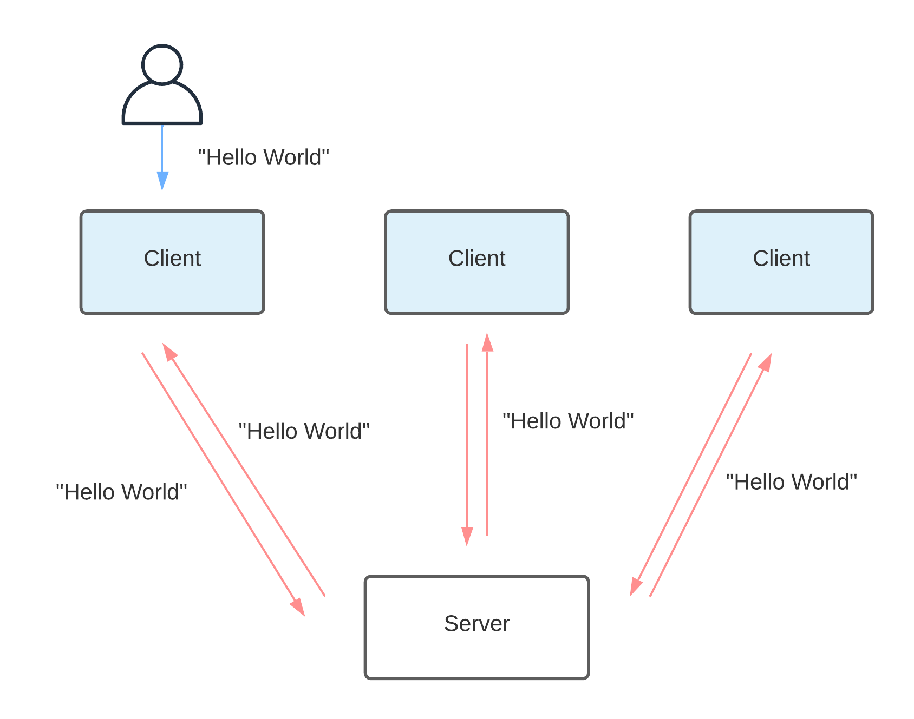

# Distributed Messaging System

COMP90015 Project 1 Group 1984

Group Members:
- Margareta Hardiyanti	\<mhardiyanti@student.unimelb.edu.au\>
- Ruifeng Luo			    \<ruifengl@student.unimelb.edu.au\>
- Zhuxin Yang			    \<zhuxiny1@student.unimelb.edu.au\>
- Taicheng Zhou			  \<taichengz@student.unimelb.edu.au\>

## Objective
Implemented distributed messaging system in a client-server architecture, and utilize multi-threading and socket communication in Java.


## Steps:
1. Client establish a TCP connection with the server.
2. Client send a message to the server.
3. The server broadcasts that message to all clients currently connected and  clients display the message to users.

## Aims:
- Allows servers to join the network at any time. 
- Allows clients to join (register/login) and leave (logout) the network at any time.
- Guarantees that an activity message sent by a client reaches all clients that are connected to the network at the time that the message was sent.
- Guarantees that all activity messages sent by a client are delivered in the same order at each receiving client.
- Ensures that clients are evenly distributed over the servers as much as possible. 

## Architecture Diagram
<p align="center">
    
</p> 

## How to run the project

### JAR files:

To run the jar files, open the terminal and change to current directory,
then type the command

For client:
```
java -jar ActivityStreamerClient.jar [arguments]
```
For server:
```
java -jar ActivityStreamerServer.jar [arguments]
```

### Source code:
To build from the source code,
import this folder as a Maven project to a prefered IDE,
then run the files Server.java and Client.java as the main class.
